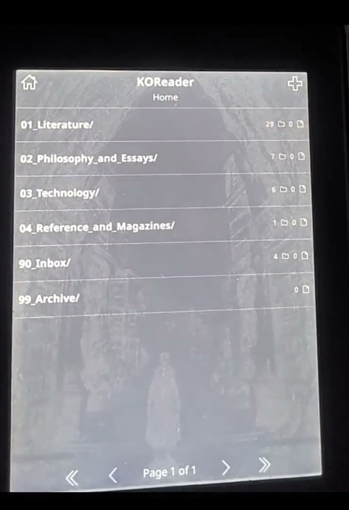

https://github.com/user-attachments/assets/e8df19a6-e2ad-48f9-b62b-c21c69aceccb

# Kindle Paperwhite 3: WinterBreak2 verificado en macOS

Procedimiento reproducible para liberar un **Kindle Paperwhite 3 (7.ª generación, 2015)** con firmware **5.16.2.1.1** desde macOS, conservar los libros e instalar KUAL, bloqueo OTA, KOReader y KindleForge. Incluye además una configuración local-first comprobada, biblioteca ordenada y canales de recuperación por SSH.

## Demostración del arranque

<p align="center">
  <a href="assets/videos/kindle-pw3-arranque-koreader.mp4">
    
  </a>
</p>

<p align="center">
  <strong><a href="assets/videos/kindle-pw3-arranque-koreader.mp4">▶ Ver el arranque completo (45 s)</a></strong><br>
  <sub>Reinicio normal del PW3, ilustración local y apertura automática de KOReader. Video H.264 sin audio.</sub>
</p>

Esta documentación proviene de una ejecución real sobre un PW3 con prefijo de serie `G090G1`. La ruta que funcionó fue:

```text
WinterBreak2 → Hotfix 2.3.7 → KUAL directo por Update Your Kindle
→ Rename OTA Binaries → KOReader kindlepw2 → restauración del backup
```

El intento previo con LanguageBreak no funcionó de forma confiable en este dispositivo y no forma parte del procedimiento. La guía explica el fallo para evitar que otra persona repita horas de ciclos de Demo Mode.

## Empezar aquí

1. Leer completa la [guía detallada](docs/GUIA_COMPLETA.md) antes de conectar el Kindle.
2. Descargar los paquetes indicados en [paquetes/README.md](winterbreak2-pw3/paquetes/README.md).
3. Ejecutar `./winterbreak2-pw3/scripts/00-verificar-paquetes.sh`.
4. Seguir la guía sin saltar comprobaciones ni cambiar el estado del cable.

Toda la documentación está indexada en [docs/README.md](docs/README.md). Las aplicaciones adicionales compatibles están explicadas en [docs/APLICACIONES_COMPATIBLES.md](docs/APLICACIONES_COMPATIBLES.md), y el estado concreto del equipo de prueba se conserva en el [inventario del dispositivo](docs/INVENTARIO_DEL_DISPOSITIVO.md).

## Herramientas posteriores al jailbreak

La guía de liberación termina en `docs/` y no depende de estas herramientas. La
configuración aplicada al dispositivo de prueba queda reproducible en:

- [kindle-tools/installed-apps](kindle-tools/installed-apps/README.md): submenú no destructivo de KUAL que agrupa accesos a las aplicaciones ya instaladas;
- [kindle-tools/koreader-personalization](kindle-tools/koreader-personalization/README.md): Night Mode temprano, Home de biblioteca, fondo y autoinicio;
- [kindle-tools/library](kindle-tools/library/README.md): organización reversible de libros con manifiestos y hashes;
- [kindle-tools/ssh](kindle-tools/ssh/README.md): acceso por clave y recuperación local;
- [kindle-tools/usbnetwork](kindle-tools/usbnetwork/README.md): contingencia física independiente de Wi-Fi.

El desarrollo futuro permanece deliberadamente separado:

- [experiments/README.md](experiments/README.md): índice de investigación para desarrollar una aplicación propia;
- [viabilidad técnica](experiments/FEASIBILITY.md), [arquitectura propuesta](experiments/ARCHITECTURE.md) y [hoja de ruta](experiments/ROADMAP.md).

Nada dentro de `experiments/` debe considerarse parte del jailbreak ni instalarse siguiendo la guía principal.

## Qué no contiene este repositorio

- Los libros y documentos del usuario no se publican. En la ejecución documentada se restauraron al Kindle y luego se eliminó el backup local por decisión del propietario.
- Los paquetes de jailbreak y aplicaciones son propiedad de sus respectivos proyectos y están ignorados por Git.
- No se incluyen números de serie completos, credenciales Wi‑Fi ni registros personales del dispositivo.

## Alcance estricto

Los scripts rechazan un firmware distinto cuando macOS permite leer `system/version.txt`. No se deben reutilizar sin investigación en otro modelo o firmware. Un paquete incorrecto puede provocar pérdida de datos o dejar el Kindle sin arrancar.
